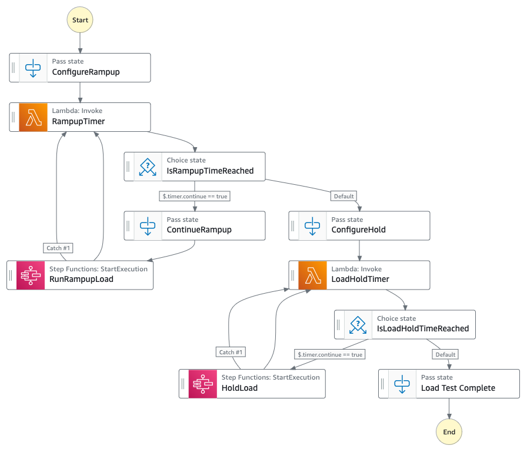

# Serverless load generator using distributed map 

This project creates a serverless load generator Step Function and uses distributed map to load test a workload. This pattern generates load for a Lambda function, however this can be extended to load test other workloads like HTTP endpoints, APIs or other services that Step Functions support.

It creates two AWS Step Functions. The first, `LoadGeneratorStateMachine`, is responsible for orchestrating the ramp up of the load, checking the concurrency and holding the load for a specified period of time. The second step function, `RunLoadStateMachine`, is responsible for generating the load by using a distributed map and invoking the workload that needs to be load tested.

The step function `LoadGeneratorStateMachine` is the entry point and takes in 3 parameters:

 - `rampUpDuration` The time in minutes over which the load should gradually be increased till it reaches the `targetConcurrency`
 - `duration` The time in minutes after the `rampupDuration` the load test should run
 - `targetConcurrency` The total number of simulated concurrent virtual users that invoke the workload in parallel

Important: this application uses various AWS services and there are costs associated with these services after the Free Tier usage - please see the [AWS Pricing page](https://aws.amazon.com/pricing/) for details. You are responsible for any AWS costs incurred. No warranty is implied in this example.

## Requirements

* [Create AWS Account](https://portal.aws.amazon.com/gp/aws/developer/registration/index.html) in case you do not have it yet or log in to an existing one
* An IAM user or a Role with sufficient permissions to deploy and manage AWS resources
* [AWS CLI](https://docs.aws.amazon.com/cli/latest/userguide/install-cliv2.html) installed and configured
* [Git Installed](https://git-scm.com/book/en/v2/Getting-Started-Installing-Git)
* [AWS Serverless Application Model](https://docs.aws.amazon.com/serverless-application-model/latest/developerguide/serverless-sam-cli-install.html) (AWS SAM) installed
* A Lambda function that you need to load test. This could be an existing Lambda function, or you could [create a new Lambda function](https://docs.aws.amazon.com/lambda/latest/dg/getting-started.html#getting-started-create-function).

## Deployment Instructions

1. Create a new directory, navigate to that directory in a terminal and clone the GitHub repository:
   ```
   git clone https://github.com/aws-samples/step-functions-workflows-collection
   ```
1. Change directory to the workflow directory:
   ```
   cd step-functions-load-testing
   ```
1. From the command line, use AWS SAM to build and deploy the AWS resources for the workflow as specified in the template.yaml file:
   ```
   sam build
   sam deploy --guided
   ```
   1. During the prompts:

      - Enter a stack name
      - Enter the desired AWS Region
      - For the Parameter `LambdaFunctionName`, enter the ARN of the Lambda function that you want to load test
      - For the Parameter `LambdaParameters`, enter the parameters that need to be passed to the Lambda function
        - For example, if your lambda function accepts this input
        ```json
         {
           "s3Bucket": "my-s3-bucket",
           "s3Key": "photo.jpeg"
         }
         ```
        escape it appropriately:
        ```shell
           Parameter LambdaParameters []: {  \"s3Bucket\": \"my-s3-bucket\",  \"s3Key\": \"photo.jpeg\" }
        ```
      - Allow SAM CLI to create IAM roles with the required permissions.

      Once you have run `sam deploy --guided` mode once and saved arguments to a configuration file (samconfig.toml), you can use `sam deploy` in future to use these defaults.

1. Note the output from the SAM deployment process. This contains the ARN of the step function that will be used for load generation.

## How it works



When the step function is triggered it first starts the ramp-up phase. In this phase it starts a timer to monitor if the ramp up time is reached. It then uses a distributed map to  calls to the Lambda function in parallel. After each execution of the distributed map ends, the Step Function checks if the ramp up time is reached and increases the concurrency of the distributed map. Once the ramp up time is reached, the state machine then send the load to the Lambda for the time specified in input.

Note that the state machine runs the distributed map and the time in serial. The state machine need to wait for an iteration of the distributed map to finish, then check if the ramp up or load time is reached and then trigger another round of load. If there are some slow executions in the Lambda, this can lead to "saw-effect", where you might see load on the Lambda drop down before it picks up again periodically. This usually is a good indication that your workload has some condition leader to such stragglers and worth investigating. If this is expected, you can smooth out the load, but creating multiple executions of this step function, that are spaced out over time. The step function also has the max execution time set to 30 seconds in [load-orchestrator-statemachine.asl.json](statemachine/load-orchestrator-statemachine.asl.json), which you can tweak based on your workload's characteristics.

## Testing
1. Navigate to the Step Function page on the AWS console and locate the `LoadGeneratorStateMachine` step function
2. Click on the "Start execution" button
3. On the pop-up window, use the below JSON as the input and hit "Start execution" button. This will start a load generation that will simulate 5 concurrent users, ramped up over 1 minute and will hold the load for 5 minutes.
    ```json
       {
          "rampUpDuration": 1,
          "duration": 2,
          "targetConcurrency": 5
       }
    ```
4. Navigate to the Lambda function that you are load testing and check the "Monitor" tab to view metrics on how the Lambda behaves under load

## Cleanup
 
1. Navigate to the root of the repository.
1. Delete the stack
    ```
    sam delete
    ```

----
Copyright 2024 Amazon.com, Inc. or its affiliates. All Rights Reserved.

SPDX-License-Identifier: MIT-0
